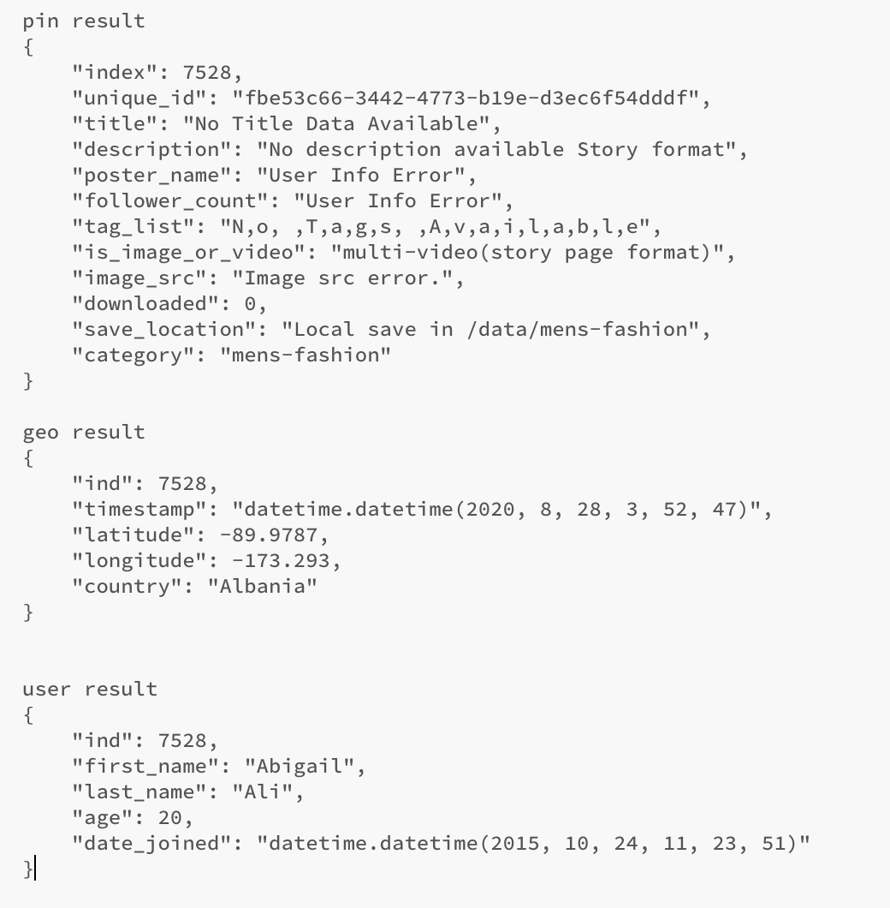
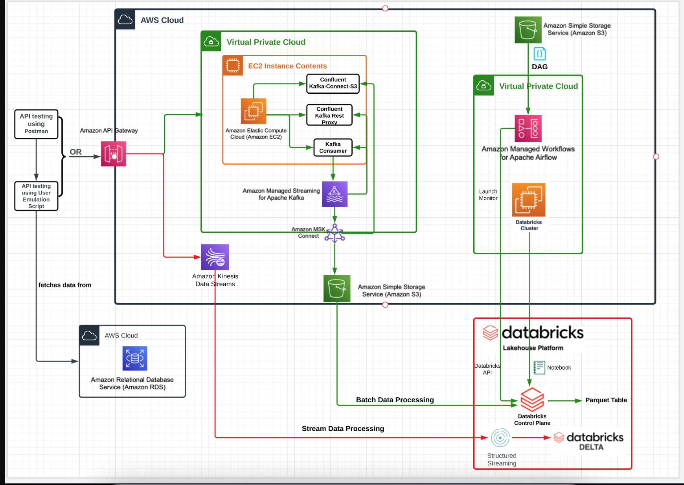
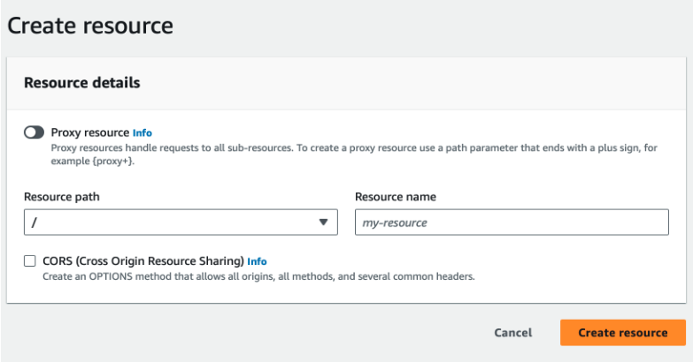
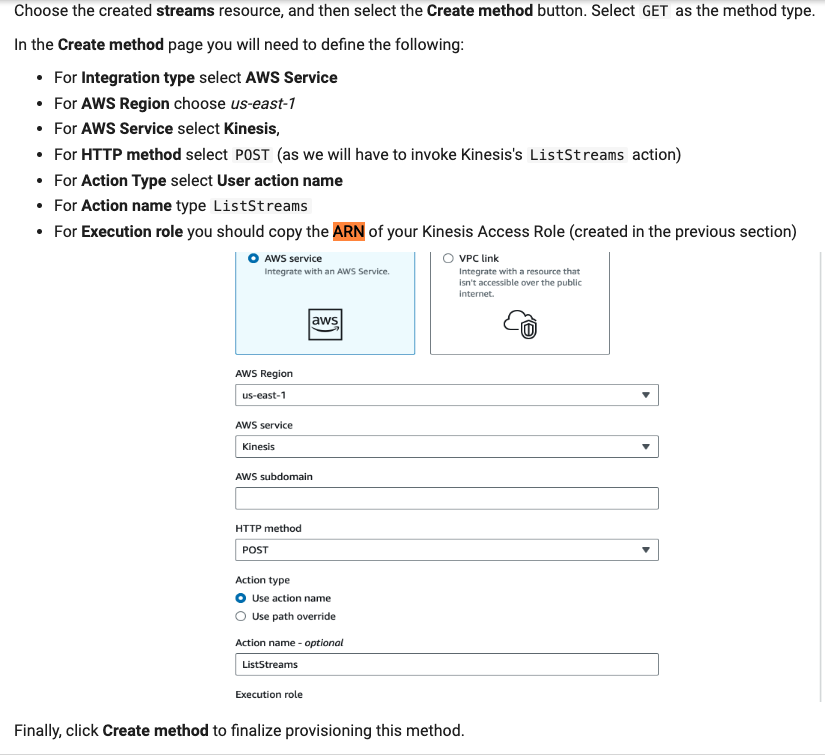
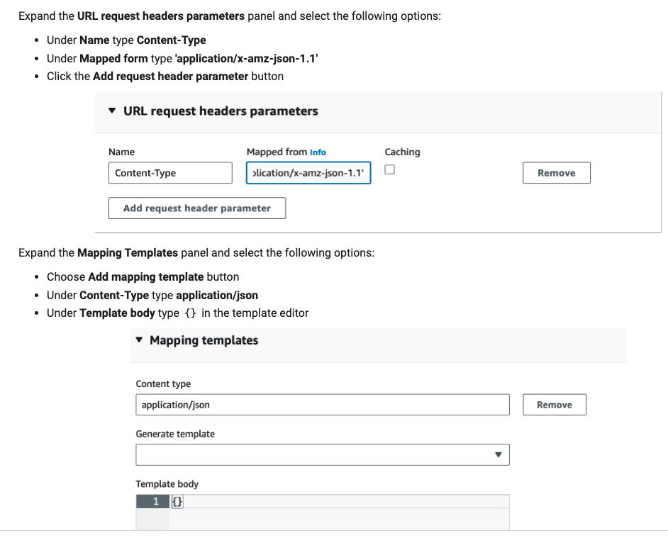
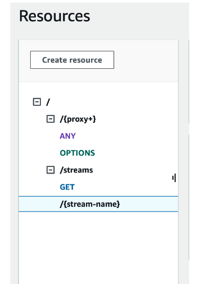

# Pinterest Data Pipeline

This project involves creating a data pipeline similar to Pinterest's, which processes billions of data points daily to enhance user experience. The pipeline leverages various AWS services to collect, store, process, and analyze data efficiently.

## Overview- Pinterest Data

In order to understand the data Pinterest's Engineers are likely to work with, this project has a script user_posting_emulation_to_console.py, which contains three tables with data resembling data received by the Pinterest API when a POST request is made by a user uploading data to Pinterest:

- **pinterest_data** contains data about posts being updated to Pinterest
- **geolocation_data** contains data about the geolocation of each Pinterest post found in pinterest_data
- **user_data** contains data about the user that has uploaded each post found in pinterest_data

When running the provided script, it prints out pin_result, geo_result and user_result. Each represents one entry in their corresponding table. Let's have a look how these results look like:



## Table of Contents
<!-- no toc -->
- [Introduction](#introduction)
- [Architecture](#architecture)
- [Prerequisites](#prerequisites)
- [Pipeline Tools](#pipeline-tools)
- [Pipeline Building](#pipeline-building)

## Introduction

This project aims to build a data pipeline on AWS that mimics Pinterest's data processing capabilities. The pipeline will collect large volumes of data, process it, and provide valuable insights to enhance user engagement. Key AWS services used include Amazon MSK, Amazon S3, AWS Lambda, Amazon Kinesis(stream processing), and for batch processing Databricks, Spark, Amazon Managed Workflows for Apache Airflow (Amazon MWAA).

## Architecture



## Prerequisites

Before you begin, ensure you have the following:

- An AWS account with appropriate permissions.
- AWS CLI installed and configured on your local machine.
- Basic knowledge of AWS services and data processing concepts.
- Knowledge of Apache kafka, AWS MSK, Kinesis
- Install python, boto3, sqlalchemy, pymysql, json  

## Pipeline Tools

[AWS MSK](https://aws.amazon.com/msk/)- Amazon Managed Streaming for Apache Kafka (Amazon MSK) plays a crucial role in data pipeline project by providing a fully managed Apache Kafka service. This service is essential for real-time data streaming and integration, which forms the backbone of the pipeline. Amazon MSK is a critical component of data pipeline, providing robust data ingestion, streaming, and integration capabilities.
- [AWS MSK Connect](https://docs.aws.amazon.com/msk/latest/developerguide/msk-connect.html)- MSK Connect is a feature of Amazon MSK that makes it easy for developers to stream data to and from their Apache Kafka clusters. From the developer guide:
>With MSK Connect, you can deploy fully managed connectors built for Kafka Connect that move data into or pull data from popular data stores like Amazon S3... Use source connectors to import data from external systems into your topics. With sink connectors, you can export data from your topics to external systems.
 
- [Apache Kafka](https://kafka.apache.org/)- Apache Kafka is an open-source distributed event streaming platform designed to handle real-time data feeds with high throughput, fault tolerance, and scalability.
- [Kafka REST Proxy](https://docs.confluent.io/platform/current/kafka-rest/index.html) 
>The Confluent REST Proxy provides a RESTful interface to an Apache Kafka® cluster, making it easy to produce and consume messages, view the state of the cluster, and perform administrative actions without using the native Kafka protocol or clients.
>Kafka REST Proxy is a RESTful web service interface for interacting with an Apache Kafka cluster. It provides a way to produce and consume messages, manage topics, and inspect Kafka's state over HTTP without needing to use the native Kafka clients directly. This is particularly useful for applications and systems that do not have direct access to Kafka's native APIs, or when you need a simpler, language-agnostic way to interact with Kafka.

- [Apache Spark](https://spark.apache.org/docs/3.4.1/) - Apache Spark™ is a multi-language engine for executing data engineering, data science, and machine learning on single-node machines or clusters. From the docs:
>Spark provides high-level APIs in Java, Scala, Python, and R, and an optimized engine that supports general execution graphs. It also supports a rich set of higher-level tools including Spark SQL for SQL and structured data processing, pandas API on Spark for pandas workloads, MLlib for machine learning, GraphX for graph processing, and Structured Streaming for incremental computation and stream processing.
- [AWS API Gateway](https://aws.amazon.com/api-gateway/)- Amazon API Gateway is a fully managed service that makes it easy for developers to create, publish, maintain, monitor, and secure APIs at any scale. APIs act as the "front door" for applications to access data, business logic, or functionality from your backend services. 
- [PySpark](https://spark.apache.org/docs/3.4.1/api/python/index.html)- PySpark is the Python API for Apache Spark.
>It enables you to perform real-time, large-scale data processing in a distributed environment using Python. It also provides a PySpark shell for interactively analyzing your data. PySpark combines Python’s learnability and ease of use with the power of Apache Spark to enable processing and analysis of data at any size for everyone familiar with Python.
- [Databricks](https://docs.databricks.com/en/index.html)- This project uses the Databricks platform to perform Spark processing of batch and streaming data. From the documentation:
>Databricks is a unified, open analytics platform for building, deploying, sharing, and maintaining enterprise-grade data, analytics, and AI solutions at scale. The Databricks Lakehouse Platform integrates with cloud storage and security in your cloud account, and manages and deploys cloud infrastructure on your behalf.
- [Managed Workflows for Apache Airflow](https://docs.aws.amazon.com/mwaa/latest/userguide/what-is-mwaa.html) - Apache Airflow enables users to use Python to build scheduling workflows for batch-oriented processes. This project uses MWAA to orchestrate batch processing on the Databricks platform. From AWS docs:
>With Amazon MWAA, you can use Apache Airflow and Python to create workflows without having to manage the underlying infrastructure for scalability, availability, and security.
- [AWS Kinesis](https://aws.amazon.com/kinesis/) - AWS Kinesis is a managed service for processing and analysing streaming data. In this project I've used Kinesis Data Streams to collect and store data temporarily before using Spark on Databricks to read and process the stream.

## Pipeline Building

### Creating a .pem key file locally
In order to create .pem file locally on VSCODE, content of the key is needed to save into the .pem file. EC2 instance, already provisioned by the Admin Team, follow the steps below to create .pem file.
1.  First navigate to Parameter Store in your AWS account.
2.  Using KeyPairId (it was provided by the admin) find the specific key pair associated with your EC2 instance. Select this key pair and under the Value field select 'Show'.This will reveal the content of your key pair. Copy its entire value (including the BEGIN and END header) and paste it in the .pem file in VSCode.
3.  Navigate to the EC2 console and select this instance, and under the Details section find the Key pair name and make a note of this. Save the previously created file in the VSCode using the following format: Key pair name.pem.

### Connect to the EC2 instance
Follow the Connect instructions (SSH client) on the EC2 console to do this
### Creating an Apache Cluster With AWS MSK
The first step is to create a kafka cluster, here using AWS MSK. In this project, it was provisioned by the AiCore IT Team. The documentation includes a good guide for [getting started](https://docs.aws.amazon.com/msk/latest/developerguide/getting-started.html) and you can follow the steps to get a cluster up and running here. 
### Creating a Client Machine for the Cluster
The next step is to create an Apache Client to communicate with AWS MSK Cluster. In this project EC2 instance works as Apache Client. It was also provisioned by the AiCore Team. You can Create an Amazon linux EC2 instance free tier, create key pair type - RSA, private key file format - '.pem' and select the security group associated with the Kafka cluster (AWS MSK).
Next, edit inbound rules to 'All Traffic'.<br>
### Set up Kafka on the EC2 instance

Once you get connected to EC2, run the following commands on EC2 instance command line:
```
sudo yum update
# install Java - required for Kafka to run
sudo yum install java-1.8.0
# download Kafka - must be same version as MSK cluster (in this case 2.12-2.8.1)
wget https://archive.apache.org/dist/kafka/2.8.1/kafka_2.12-2.8.1.tgz
# unpack .tgz
tar -xzf kafka_2.12-2.8.1.tgz
``` 
### Install the IAM MSK authentication package on your client EC2 machine  
This package is necessary to connect to MSK clusters that require IAM authentication.
If you list your directories, you should see a Kafka directory inside your EC2 client. 
First, navigate to your Kafka installation folder and then in the 'libs' folder. Inside, we will download the IAM MSK authentication package from Github, using the following command:
``` 
# navigate to the correct directory
cd kafka_2.12-2.8.1/libs/
# download the package
wget https://github.com/aws/aws-msk-iam-auth/releases/download/v1.1.5/aws-msk-iam-auth-1.1.5-all.jar

``` 
1. After downloading the file aws-msk-iam-auth-1.1.5-all.jar from the provided link, you will find it located inside the 'libs' directory. In order to ensure that the Amazon MSK IAM libraries are easily accessible to the Kafka client, regardless of the location from which commands are executed, we will set up an environment variable called CLASSPATH.
2. Setting up CLASSPATH in .bashrc
    ```
    # open bash config file
    nano ~/.bashrc
    ```
    Add the following line to the config file, then save and exit:
    ```
    export CLASSPATH=/home/ec2-user/kafka_2.12-2.8.1/libs/aws-msk-iam-auth-1.1.5-all.jar
    ```

    Activate changes to .bashrc
    ```
    source ~/.bashrc
    
    ```

We also need to create an IAM role for the client machine.(For this projects this role was created by the Admin and attached to the respective EC2 instance). You can create one by following the steps: 

1. Navigate to the AWS IAM dashboard, select 'Roles' from the left-hand menu and then click on 'Create role'.
2. Select 'AWS service' and 'EC2', then click on 'Next'.
3. On the next page, select 'Create policy'.
4. In the policy editor, choose JSON format and paste in the following policy. Note: this policy is somewhat open - a more restrictive policy would be more appropriate for a production environment
    ```json
    {
        "Version": "2012-10-17",
        "Statement": [
            {
                "Sid": "VisualEditor0",
                "Effect": "Allow",
                "Action": [
                    "kafka:ListClustersV2",
                    "kafka:ListVpcConnections",
                    "kafka:DescribeClusterOperation",
                    "kafka:GetCompatibleKafkaVersions",
                    "kafka:ListClusters",
                    "kafka:ListKafkaVersions",
                    "kafka:GetBootstrapBrokers",
                    "kafka:ListConfigurations",
                    "kafka:DescribeClusterOperationV2"
                ],
                "Resource": "*"
            },
            {
                "Sid": "VisualEditor1",
                "Effect": "Allow",
                "Action": "kafka-cluster:*",
                "Resource": [
                    "arn:aws:kafka:*:<AWS-UUID>:transactional-id/*/*/*",
                    "arn:aws:kafka:*:<AWS-UUID>:group/*/*/*",
                    "arn:aws:kafka:*:<AWS-UUID>:topic/*/*/*",
                    "arn:aws:kafka:*:<AWS-UUID>:cluster/*/*"
                ]
            },
            {
                "Sid": "VisualEditor2",
                "Effect": "Allow",
                "Action": "kafka:*",
                "Resource": [
                    "arn:aws:kafka:*:<AWS-UUID>:cluster/*/*",
                    "arn:aws:kafka:*:<AWS-UUID>:configuration/*/*",
                    "arn:aws:kafka:*:<AWS-UUID>:vpc-connection/*/*/*"
                ]
            }
        ]
    }

    ```
   
5. On the next page, give the policy a descriptive name and save the policy.
6. Back in the create role tab in the browser, click refresh to show the new policy and select the policy.
7. Click 'Next', give the role a descriptive name and save the role.
8. In the EC2 dashboard, click on the client instance.
9. Under 'Actions' and 'Security', click on 'Modify IAM role'.
10.  Select the role just created and click on 'Update IAM role'.
     
##### Once permission policy is set, next configuring the Trust Policy(Who is allowed to take on certain responsibilities):
1. Navigate to the IAM console on your AWS account
2. Here, on the left hand side select the Roles section
3. You should see a list of roles, select the role attached to your EC2 instance,e.g;  <your_UserId>-ec2-access-role
4. Copy this role ARN and make a note of it, as we will be using it later for the cluster authentication
5. Go to the Trust relationships tab and select Edit trust policy
6. Click on the Add a principal button and select IAM roles as the Principal type
7. Replace ARN with the "ec2-access-role" ARN you have just copied
By following the steps above you will be able to now assume the "ec2-access-role", which contains the necessary permissions to authenticate to the MSK cluster.


### Configure your Kafka client to use AWS IAM authentication to the cluster
To do this, you will need to modify the client.properties file, inside your kafka_folder/bin directory accordingly.

```
# create client.properties file
nano client.properties
```
Add the following code to the client.properties file, then save and exit:
```
# Sets up TLS for encryption and SASL for authN.
security.protocol = SASL_SSL

# Identifies the SASL mechanism to use.
sasl.mechanism = AWS_MSK_IAM

# Binds SASL client implementation.
sasl.jaas.config = software.amazon.msk.auth.iam.IAMLoginModule required;

# Encapsulates constructing a SigV4 signature based on extracted credentials.
# The SASL client bound by "sasl.jaas.config" invokes this class.
sasl.client.callback.handler.class = software.amazon.msk.auth.iam.IAMClientCallbackHandler
```
### Create kafka topics
To create a topic, make sure you are inside your <KAFKA_FOLDER>/bin and then run the following command, replacing BoostrapServerString, using the MSK Management Console, retrieve the Bootstrap servers string and the Plaintext Apache Zookeeper connection string. Then create three topics with your desired topic name:

./kafka-topics.sh --bootstrap-server BootstrapServerString --command-config client.properties --create --topic <topic_name>

Topic names should be like this for this project:
   *  <your_UserId>.pin for the Pinterest posts data
   - <your_UserId>.geo for the post geolocation data
   *  <your_UserId>.user for the post user data

### Batch Processing:Connect a MSK cluster to a S3 bucket
In this part I am using MSK Connect to connect the MSK Cluster to a S3 bucket, such that any data going through the cluster will be automatically saved and stored in a dedicated S3 bucket. To do so, we need to create the custom plugin and the connector with MSK Connect from MSK console. A plugin will contain the code that defines the logic of our connector. We will use the client EC2 machine we have previously used to connect to our cluster for this step.

When creating custom plugin we are required to set up Connector configuration settings, that says what kind of this connector is (source or sink)? and here, this is can be thought of as a consumer in the sense that it consumes records from Kafka topics and intigrating with S3 bucket.  

1. First connect to your client EC2 machine and run the code from EC2: Replace the bucket name with the one you've created.
    ```
    # assume admin user privileges
    sudo -u ec2-user -i
    # create directory where we will save our connector 
    mkdir kafka-connect-s3 && cd kafka-connect-s3
    # download connector from Confluent
    wget https://d1i4a15mxbxib1.cloudfront.net/api/plugins/confluentinc/kafka-connect-s3/versions/10.0.3/confluentinc-kafka-connect-s3-10.0.3.zip
    # copy connector to our S3 bucket
    aws s3 cp ./confluentinc-kafka-connect-s3-10.0.3.zip s3://<BUCKET_NAME>/kafka-connect-s3/
    ```
2. Create your custom plugin in the MSK Connect console. 
3. Create the connector.
   In the MSK console, select Connectors under the MSK Connect section on the left side of the console. Choose Create connector. In the list of plugin, select the plugin you have just created, and then click Next. For the connector name choose the desired name, and then choose your MSK cluster from the cluster list. In the Connector configuration settings copy the following configuration:
    ```
    connector.class=io.confluent.connect.s3.S3SinkConnector
    # same region as our bucket and cluster
    s3.region=us-east-1
    flush.size=1
    schema.compatibility=NONE
    tasks.max=3
    # include nomeclature of topic name, given here as an example will read all data from topic names starting with msk.topic....
    topics.regex=<YOUR_UUID>.*
    format.class=io.confluent.connect.s3.format.json.JsonFormat
    partitioner.class=io.confluent.connect.storage.partitioner.DefaultPartitioner
    value.converter.schemas.enable=false
    value.converter=org.apache.kafka.connect.json.JsonConverter
    storage.class=io.confluent.connect.s3.storage.S3Storage
    key.converter=org.apache.kafka.connect.storage.StringConverter
    s3.bucket.name=<BUCKET_NAME>

    ```
Replace bucket_name and your_UUID with your user_id.
Leave the rest of the configurations as default, except for:

- Connector type change to Provisioned and make sure both the MCU count per worker and Number of workers are set to 1
- Worker Configuration, select Use a custom configuration, then pick confluent-worker
- Access permissions, where you should select the IAM role you have created previously
Skip the rest of the pages until you get to Create connector button page. Once your connector is up and running you will be able to visualise it in the Connectors tab in the MSK console.

### Batch Processing: Configuring an API in API Gateway
To replicate the Pinterest's experimental data pipeline we will need to buid our own API. This API will send data to the MSK cluster, which in turn will be stored in an S3 bucket, using the connector we have built in the previous step.

In this project we are using a python script that makes HTTP POST request to the API Gateway endpoints, and these endpoints route the data to the Kafka REST Proxy running on the EC2 instance.

The Kafka REST Proxy receives HTTP requests from the Python script, translates these HTTP requests into Kafka Producer operations, it then publishes the data to the appropriate Kafka topics in the MSK Cluster.

### Building a Kafka REST Proxy integration method for the API.
In this project an API is created by the Team Admin, next we need to create the resource.


After creating the API resource, next integrating the API(REST Proxy) with the Kafka Client EC2(From EC2 details copy the PublicDNS.) and paste it in the URL:"http://your-client-public-dns:8082/{proxy}" and put this value in Endpoint URL. 


### Installing Confluent package for REST proxy on EC2 client
To be able to consume data using MSK from the API we have just created, we will need to download some additional packages on a client EC2 machine, that will be used to communicate with the MSK cluster.

To install the REST proxy package run the following commands on your EC2 instance:
```
sudo wget https://packages.confluent.io/archive/7.2/confluent-7.2.0.tar.gz
tar -xvzf confluent-7.2.0.tar.gz 
```
You should now be able to see a confluent-7.2.0 directory on your EC2 instance. To configure the REST proxy to communicate with the desired MSK cluster, and to perform IAM authentication you first need to navigate to confluent-7.2.0/etc/kafka-rest. Inside here run the following command to modify the kafka-rest.properties file:
```
nano kafka-rest.properties
```
You should add the following to your kafka-rest.properties file:
```
# Sets up TLS for encryption and SASL for authN.
client.security.protocol = SASL_SSL

# Identifies the SASL mechanism to use.
client.sasl.mechanism = AWS_MSK_IAM

# Binds SASL client implementation.
client.sasl.jaas.config = software.amazon.msk.auth.iam.IAMLoginModule required awsRoleArn="Your Access Role";

# Encapsulates constructing a SigV4 signature based on extracted credentials.
# The SASL client bound by "sasl.jaas.config" invokes this class.
client.sasl.client.callback.handler.class = software.amazon.msk.auth.iam.IAMClientCallbackHandler
```
### Deploy API
Make note of the Invoke URL after deploying the API. Your external Kafka REST Proxy, which was exposed through API Gateway will look like:

https://YourAPIInvokeURL/test/topics/<AllYourTopics>

### Starting the REST proxy
Before sending messages to the API, in order to make sure they are consumed in MSK, we need to start our REST proxy. To do this, first navigate to the confluent-7.2.0/bin folder, and then run the following command:
```
./kafka-rest-start /home/ec2-user/confluent-7.2.0/etc/kafka-rest/kafka-rest.properties
```
After this run the Python script that for sending messages to an AWS API Gateway API using the Invoke URL.(user_posting_emulation_batch_data.py)

## Batch Processing using Databricks
### Mount S3 bucket to Databricks
In order to clean and query the batch data, you will need to read this data from your S3 bucket into Databricks. To do this, you will need to mount the desired S3 bucket to the Databricks account. (In this project, Databricks account has been granted full access to S3).

The file **mount_s3_and_retrieve_pinterest_data.ipynb** is a notebook that was run on the Databricks platform. The steps carried out in the notebook are:
- Import the necessary pyspark sql library
- Define the path to the Delta table
- Read the Delta table to a Spark DataFrame
- Get the AWS access key and secret key from the spark dataframe
- Encode the secrete key
- Mount the S3 bucket 
- Read the JSON format dataset from S3 into Databricks
### Clean data using Apache Spark on Databricks
The file **clean_s3_batch_data.ipynb** contains the code for performing the necessary cleaning of the dataframes
### Querying the cleaned data using Apache Spark on Databricks
The file **query_batch_data.ipynb** contains the code for querying the dataframes and returning specific insights about the data.
### Orchestrating automated workflow of notebook on Databricks
MWAA was used to automate the process of running the batch processing on Databricks. The file 129bc7e0bd61_dag.py is the Python code for a directed acyclic graph (DAG) that orchestrates the running of the batch processing notebook described above. The file was uploaded to the MWAA environment, where Airflow is utilised to connect to and run the Databricks notebook at scheduled intervals, in this case @daily.
## Stream Processing:AWS Kinesis
### Create data streams on Kinesis

The first step in processing streaming data was to create three streams on AWS Kinesis, one for each of the data sources.
### Create API proxy for uploading data to streams

Configuring previously created REST API to allow it to invoke Kinesis actions.
All necessary permissions has been granted to my aws account by the AiCore Admin to invoke Kinesis actions. I should copy the ARN of the respective Kinesis Access Role for Execution role when creating method.

### List streams in Kinesis
Select the API, created earlier and start creating a new resource.



Click on the Save button to save the changes.
### Create, describe and delete streams in Kinesis
Under the streams resource create a new child resource with the Resource name {stream-name}. After creating this your Resources should look like this:

### Creating the following three Methods for {stream-name} resource: POST, GET and DELETE.
### Setting up the GET method.
In the Create method page you will need to define the following:
- 'Integration Type': 'AWS Service'
 - 'AWS Region': 'us-east-1'
 - 'AWS Service': 'Kinesis'
 - 'HTTP method': 'POST'
 - 'Action': '**DescribeStream**'
 - 'Execution role': 'arn of IAM role created'
 - 
In 'Integration Request' under 'HTTP Headers', add a new header:

- 'Name': 'Content-Type'
- 'Mapped from': 'application/x-amz-json-1.1'

Under 'Mapping Templates', add new mapping template:

- 'Content Type': 'application/json'
In the Template body include the following:
```bash
{
    "StreamName": "$input.params('stream-name')"
}
```
For the other methods, the same settings were used except for:
- POST
    - 'Action': '**CreateStream**'
    - 'Mapping Template':

```bash
{
    "ShardCount": #if($input.path('$.ShardCount') == '') 5 #else $input.path('$.ShardCount') #end,
    "StreamName": "$input.params('stream-name')"
}
```
### Add records to streams in Kinesis
/record

- PUT
    - 'Action': '**PutRecord**'
    - 'Mapping Template':

```bash
{
    "StreamName": "$input.params('stream-name')",
    "Data": "$util.base64Encode($input.json('$.Data'))",
    "PartitionKey": "$input.path('$.PartitionKey')"
}
```

/records

- PUT
    - 'Action': '**PutRecords**'
    - 'Mapping Template':

```bash
{
    "StreamName": "$input.params('stream-name')",
    "Records": [
       #foreach($elem in $input.path('$.records'))
          {
            "Data": "$util.base64Encode($elem.data)",
            "PartitionKey": "$elem.partition-key"
          }#if($foreach.hasNext),#end
        #end
    ]
}
```

After creating the new resources and methods, the API must be redeployed.
### Sending data to the Kinesis streams
Running the script [user_posting_emulation_stream_data.py] starts an infinite loop that retrieves records from the RDS database and sends them via the new API to Kinesis.
### Processing the streaming data in Databricks
The Jupyter notebook [read_and_process_kinesis_streams.ipynb] contains the code for retrieving the streams from Kinesis, transforming (cleaning) the data, and then loading the data into Delta tables on Databricks cluster. The steps taken in the code are:
- Import necessary functions and types
- Define the path to the Delta table
- Read data from Kinesis streams in Databricks
- Get the AWS Access key and secret key from the spark dataframe
- Encode the secrete key
- Uses spark.readStream to retrieve Kinesis stream as dataframe
- Define schemas for each of the dataframes
- Deserialize the data
- Transform the data
- Writing streaming data to Delta Tables.
  